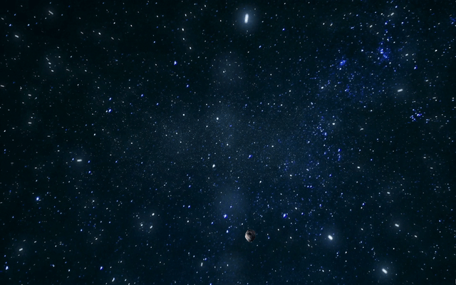

<b> This projects simulates the gravity for an object. <b>

1. I have created this using C++ with SFML. 
2. I have created a simple SFML Sprite asteroid object. 
3. The asteroid object is set on rotation around 180 degrees to replicate the spinning motions of planets and asteroids around their center. However the
   spinning of the asteroid should not be this smooth, I intend to make the rotation as more of a tumble. 
4. Anyway, to replicate gravity, I have implemented basic physics. 
5. I have created two variables to increment the movement in x and y-directions. 
6. As the user presses the "right" key, I have incremented positive x and negative-y. 
7. For the "left" key, I have incremented the negative x and negative y. 
8. As the user presses the "Up" key, the movement increases in the negative y-direction as defined by the variable in the y-direction, 
    now to make the object fall, I have created a variable that defines the height of the ground, we check if the object is above the height 
    of the ground, and if yes, we apply gravity to it, and hence the object falls. 
  

Demo  

  I love blending physics into my programming. 
This is the first attempt at simulating the concepts of molecular physics with C++.
I intend to simulate the formation of planets and the entire process of it.
